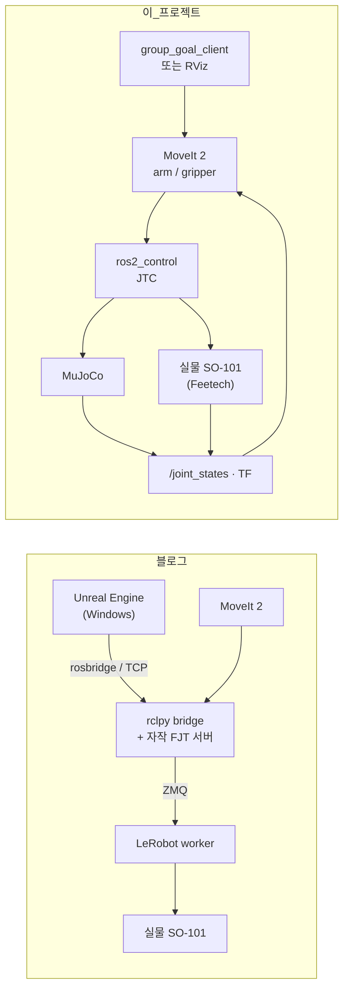

# SO-101 · LeRobot · MoveIt 2 · MuJoCo 통합 작업계획서

원본 참고: [UnrealRobotics: SO-101] 연재 22편 (https://lightbakery.tistory.com/324)
작성 기준: 2026-09-09 · 대상 로봇: SO-101 follower 1대 · 실행 환경: WSL2 Ubuntu 24.04 + ROS 2 Jazzy

## 0. 이 프로젝트가 무엇인가

블로그 연재는 **Unreal Engine ↔ ROS 2 ↔ MoveIt 2 ↔ 실물 SO-101**을 잇는 디지털 트윈이다.
이 프로젝트는 같은 목표 중 **"그룹을 지정해 계획하고 실행하고 상태를 되받는"** 축만 남기고,
**Unreal 자리를 MuJoCo 물리 시뮬레이터와 ROS 액션 클라이언트로 교체**한다.

**핵심 차이 한 줄:** 블로그는 MoveIt 아래에 **자작 브리지(ZMQ)** 를 두었고, 이 프로젝트는 **표준 ros2_control**을 두어
`mock → mujoco → real` 세 백엔드가 **같은 컨트롤러 이름·액션 주소·MoveIt 설정**을 공유하게 했다.

## 1. 블로그 연재와의 대응표

"했다"는 이번 프로젝트에서 이미 만든 것, "한다"는 순서상 다음에 실행할 것이다.

| 블로그 | 원본 내용 | 이 프로젝트에서 한 작업 | 바꾼 이유 |
|---|---|---|---|
| (1) 프로젝트 설계 | 7단계 로드맵, SO-ARM-101·STS3215 선택 | 같은 로봇·같은 4·5단계(MoveIt·RViz)를 목표로 잡고, 6·7단계(Unreal 연동)를 **MuJoCo 물리 검증으로 치환**했다 | 실물이 없는 동안에도 중력·접촉·추종오차를 검증하려면 시각화(RViz)만으로는 부족하다 |
| (2) 환경 세팅·워크스페이스·언리얼 프로젝트 | WSL2 + ROS 2 워크스페이스 + Unreal 프로젝트 생성 | `00_install_jazzy.sh`(ROS 2 Jazzy·MoveIt 2·ros2_control·mujoco_ros2_control), `01_setup_workspace.sh`(`~/so101_ws` 구성·빌드)를 **작성했다**. **Unreal 프로젝트 생성은 하지 않는다** | Windows UI가 목표가 아니다. 대신 시뮬레이터 패키지를 설치 목록에 넣었다 |
| (3) Windows↔WSL2 TCP·rosbridge | 창 밖(Unreal)과 ROS를 잇는 통신 계층 | **제외했다.** 외부 입력은 같은 WSL 안의 ROS 액션(`/move_action`)으로 받는다 | 프로세스 간 통신 계층이 하나 줄어들면 실패 지점도 줄어든다. 나중에 외부 GUI가 필요하면 이 자리에 rosbridge를 다시 끼우면 된다 |
| (4) 언리얼 Output Log | Unreal C++ 디버깅 | **제외했다.** 로그는 ROS 노드 로그와 `ros2 bag`으로 본다 | 동일 |
| (5)(6) 부품 검증·모터 연결·조립 | 하드웨어 조립·모터 ID 설정 | **이미 텔레옵 경험이 있는 기존 장비를 재사용한다.** `H` 단계에서 기존 캘리브레이션 확인부터 시작한다 | 조립된 로봇에 `setup-motors`를 다시 돌리면 EEPROM 값이 바뀐다. 업스트림 README도 ROS 명령 전에 LeRobot 캘리브레이션을 먼저 끝내라고 요구한다 |
| (7) URDF·RViz 시각화 | `legalaspro/so101-ros-physical-ai`의 `so101_description`을 sparse-checkout, `variant:=follower`로 xacro 전개 | **같은 저장소를 쓴다.** 다만 sparse-checkout 대신 vendor 클론 + `src` 심볼릭 링크로 두고, 그 위에 프로젝트 wrapper `so101.urdf.xacro`를 **작성했다** (`hardware_type` = mock/mujoco/real) | 모델은 그대로 두고 하드웨어 분기만 우리 것으로 분리해야 업스트림 갱신을 그대로 받을 수 있다 |
| (8)(9) robot_status_publisher·RViz 실시간 동기화 + leader→follower 추종 | 실물 각도를 읽어 `/joint_states`로 퍼블리시하는 노드를 직접 작성, leader를 움직이면 follower와 RViz가 따라옴 | 상태 발행 노드는 **직접 작성하지 않았다** — `joint_state_broadcaster`(ros2_control 표준)가 발행한다. 추종 쪽은 **`leader_follow.py`를 작성했다**: leader 소스를 `demo`(하드웨어 없이) / `topic`(슬라이더) / `lerobot`(실물 leader) 중에서 고르고, **follower 자리에 MuJoCo를 넣을 수 있다** | 상태 발행을 손으로 만들면 컨트롤러와 상태 소스가 이원화된다. 추종은 서보에 직접 쓰지 않고 JTC 궤적으로 보내야 MoveIt과 실행 경로를 공유한다. 실행법은 `05_미션_가이드.md` 2절 |
| (10) Joint Command 역방향 경로(ROS→로봇) | 토픽으로 목표 각도를 보내 서보를 움직임 | `controllers.yaml`에 `arm_controller`/`gripper_controller`(JTC)를 **작성했다**. 그 위에 **`joint_command.py`를 작성했다**: 도/라디안 입력, 미지정 관절은 현재 자세 유지, URDF 한계 검증, 액션(결과 수신)과 토픽(블로그와 같은 던지기) 양쪽 지원, 실행 후 **목표 vs 실측 오차 표** 출력, `--show-raw`로 동등한 `ros2 topic pub` 명령까지 표시 | 단발 각도 명령이 아니라 **시간 궤적**으로 보내야 MoveIt 결과를 그대로 실행할 수 있다. 실행법은 `05_미션_가이드.md` 3절 |
| (11)(12) Unreal 3D 파트·명령 송신 파이프 | Unreal에서 모델을 보고 명령을 만들어 보냄 | **MuJoCo viewer(물리) + RViz(계획/상태) + `group_goal_client`(명령)** 로 나눠 대체했다 | 보기·계획·명령을 한 엔진에 묶지 않으면 각각 독립적으로 검증된다 |
| **(13) MoveIt 통합 – Motion Planning** | Setup Assistant로 `arm`(5관절·KDL)/`gripper`(None) 그룹 생성. 실행은 **ros2_control 대신 rclpy bridge에 FJT 액션 서버를 붙이고 waypoint를 ZMQ REQ로 worker에 전달** | 업스트림 `so101_moveit_config`(SRDF·self-collision·joint_limits·OMPL·pick_ik)를 **복사해 재사용**하고, 그룹명을 `manipulator`→`arm`으로 치환, `moveit_controllers.yaml`만 우리 컨트롤러로 교체했다. 실행은 **표준 JTC** | 블로그 방식은 실물 전용이라 시뮬레이터와 실행 경로를 공유할 수 없다. 표준 JTC로 두면 같은 목표가 mock·MuJoCo·실물에서 그대로 실행된다 (2절 D4) |
| **(14) Unreal → MoveIt → 실물 E2E** | Unreal이 `/moveit_goal_named`·`/moveit_goal_joints`를 퍼블리시 → `moveit_goal_node.py`가 MoveGroup 액션으로 계획·실행 | **`group_goal_client.py`를 작성했다.** 그룹 허용목록, 관절/저장자세 입력, URDF 한계·NaN 검증, plan-only 기본값, 계획실패/실행실패/거부/취소/상태timeout 구분, 실행 후 **실측 오차 출력** | 토픽 단방향 입력을 액션 클라이언트로 바꿔 **결과와 실패 원인을 호출자가 받는다.** "계획 성공"을 성공으로 report하지 않는 것이 이 프로젝트의 합격 기준 |
| (15) LeRobot Record/Replay | Unreal UI에서 기록·재생 | **후속 확장으로 둔다.** 우선 `ros2 bag`으로 통신·상태만 기록한다 | 학습용 에피소드는 action/observation 정렬과 카메라가 필요해 범위가 다르다 |
| (16) WebSocket~USB 4단계 장애 진단·자동 복구 | 계층별 장애 진단 | **WebSocket 계층만 빼고 참고한다.** 트러블슈팅 표(문서 02)의 골격이 이 구조다 | 우리 계층은 MoveIt → 컨트롤러 → 하드웨어 인터페이스 → USB 4단계다 |
| (17)~(22) ROS 터미널 자동화·Unreal UI·완성 정리 | WPF GUI, 안전 UI, 관절 한계 UI, PIE 편의, 정리 | **제외.** 터미널 자동화만 `scripts/00~04`로 대체했다 | Windows UI 영역 |
| 블로그에 없는 것 | – | **MuJoCo 백엔드(`hardware_type:=mujoco`)를 새로 만들었다.** 물리 모델은 MuJoCo Menagerie의 공식 SO-101 MJCF를 가져와 2곳만 수정해 넣었다 | 업스트림 README가 `mujoco` planned로 비워둔 자리다. 모델은 이미 좋은 것이 공개돼 있어 변환기로 만들 이유가 없었다 (D13) |

**결론적으로 이 프로젝트의 1차 목표는 블로그 (13)~(14)편에 해당한다.** (15)편은 선택, (16)편은 설계 참고, (17)편 이후는 무관하다.

## 2. 중요 의사결정 기록

각 항목은 **선택지 → 트레이드오프 → 선택 → 근거** 순서다. 근거는 공식 문서·업스트림 코드·이 랩탑 실측이다.

### D1. ROS 2를 쓸 것인가
| 선택지 | 트레이드오프 |
|---|---|
| ROS 2 유지 | 노드·DDS·빌드 시스템을 감당해야 한다. 대신 계획·실행·상태의 기성 구현을 전부 얻는다 |
| ROS 2 제거 (Python MuJoCo + OMPL/mplib 등) | 설치가 가벼워진다. 그러나 **MoveIt 2가 함께 빠진다** |

**선택: ROS 2 유지.** MoveIt 2에는 비-ROS 단독 모드가 없다. 계획 파이프라인·Planning Scene Monitor·`/move_action`·컨트롤러 연결이 모두 ROS 2 노드 API 위에 있다. `moveit_core`만 링크하는 건 "MoveIt을 쓴다"가 아니라 자료구조만 재사용해 계획기를 새로 만드는 별개 작업이다. MoveIt 2가 스택 요구사항이므로 결정 종료.

### D2. 어느 배포판에서 할 것인가
실측: 이 랩탑에는 WSL 배포판이 2개 있다 — `Ubuntu`(**24.04.2, ROS 미설치, Python 3.12.3**), `Ubuntu-22.04`(**ROS 2 Humble 설치, Python 3.10.12**).

| 선택지 | 트레이드오프 |
|---|---|
| 기존 22.04 + Humble | 설치가 이미 절반 끝나 있다. `mujoco_ros2_control`도 Humble Supported이고 `ros-humble-mujoco-ros2-control 0.0.3`·`ros-humble-moveit 2.5.9`·`pick-ik 1.1.2` 후보가 실제로 있다. 그러나 업스트림 저장소가 Jazzy/24.04 기준(C++ 드라이버 빌드 리스크), 최신 LeRobot(0.5+)이 Python ≥3.12라 3.10에서는 0.4.4로 고정, `lerobot-ros`도 Jazzy만 테스트 |
| 기존 24.04 + Jazzy 신규 설치 | ROS를 새로 설치해야 한다(다운로드 시간). 대신 업스트림 두 저장소와 LeRobot 최신이 모두 기준 환경과 일치 |

**선택: 기존 24.04 배포판에 Jazzy 설치.** 배포판을 새로 만들지 않고(`wsl --install` 불필요), **22.04/Humble 환경은 삭제하지 않고 보존**한다. Humble 경로도 죽이지 않고 부록으로 남겼다(별도 계획서 17절).

### D3. 시뮬레이터와 연결 방식
| 선택지 | 트레이드오프 |
|---|---|
| `ros-controls/mujoco_ros2_control` | 공식(ros-controls) 유지, 바이너리 배포, ros2_control 하드웨어 인터페이스로 붙어 **컨트롤러를 그대로 재사용**. 단 전용 `ros2_control_node`를 써야 하고 MJCF를 따로 관리해야 한다 |
| Gazebo (`gz_ros2_control`) | ROS 생태계 통합이 가장 성숙. 그러나 LeRobot 생태계·정책 학습 쪽에서 MuJoCo가 사실상 표준이고, 요구 스택이 MuJoCo다 |
| Python MuJoCo 직접 제어 | 가장 단순. 그러나 MoveIt·컨트롤러와 연결되지 않아 목표(그룹 계획·실행)를 잃는다 |

**선택: `mujoco_ros2_control`.** 공식 문서에서 확인한 사실을 그대로 따랐다 — 플러그인 `mujoco_ros2_control/MujocoSystemInterface`, 파라미터 `mujoco_model`, "a slightly modified `ros2_control` node from this package must be used". launch도 공식 데모(`01_basic_robot.launch.py`) 노드 구성을 그대로 옮겼다.

### D4. 궤적 실행 경로: 표준 ros2_control vs 블로그의 ZMQ 브리지
| 선택지 | 트레이드오프 |
|---|---|
| 블로그 방식(자작 FJT 서버 → ZMQ → LeRobot worker) | LeRobot Python 환경과 ROS를 프로세스로 분리할 수 있고, 서보 수준 안전 클램프를 LeRobot 쪽에 유지. 그러나 **시간 보간·추종오차·tolerance 감시를 직접 구현**해야 하고, 시뮬레이터에는 같은 경로를 쓸 수 없다 |
| 표준 `joint_trajectory_controller` | 보간·tolerance·액션 결과가 이미 구현되어 있고 **mock/mujoco/real이 같은 인터페이스를 공유**. 대신 실물은 C++ 하드웨어 인터페이스(업스트림 `feetech_ros2_driver`)에 의존 |

**선택: 표준 JTC.** 이 프로젝트의 목적이 "같은 상위 요청으로 시뮬레이터와 실물을 모두 제어"이기 때문이다. 블로그는 실물만 목표였으므로 그 선택이 그 문맥에서는 합리적이다. 단순히 Unreal 패키지 이름을 MuJoCo로 바꾸는 작업이 아니라는 점이 여기서 갈린다.

### D5. MoveIt 설정: 업스트림 재사용 vs Setup Assistant 재생성
| 선택지 | 트레이드오프 |
|---|---|
| 업스트림 `so101_moveit_config` 복사 | 검증된 self-collision matrix·joint_limits·OMPL·Pilz·pick_ik·RViz 설정을 즉시 얻는다(1–2시간). 대신 이름 규약(`manipulator`, `follower/` 접두사, ParallelGripperCommand)을 우리 것으로 맞춰야 한다 |
| Setup Assistant로 재생성 | 이름을 처음부터 내가 정하고 도구 사용법을 익힌다(2–4시간). self-collision matrix를 다시 만들어야 한다 |

**선택: 재사용.** SRDF의 `<robot name="so101_arm">`이 우리 xacro의 robot 이름과 같아 그대로 붙는 것을 확인했다. 재생성 경로도 문서에 남겨 두었다(학습 목적이면 그쪽).

### D6. 그룹 이름: `manipulator` 유지 vs `arm` 통일
**선택: `arm`으로 통일.** 복사 직후 `grep -rl manipulator | xargs -r sed -i 's/manipulator/arm/g'` 한 번으로 SRDF·`kinematics.yaml`·`ompl_planning.yaml`·`moveit.rviz`가 동시에 맞는다. 목표 문장·클라이언트·문서가 모두 `arm`/`gripper`라서 이름이 두 개 존재하는 상태를 남기지 않는 편이 낫다고 판단했다.

### D7. 그리퍼 인터페이스: ParallelGripperCommand vs 1관절 JTC
| 선택지 | 트레이드오프 |
|---|---|
| 업스트림의 `ParallelGripperCommand`(`gripper_cmd`) | 그리퍼 의미(열림 폭·최대힘)를 표현하기 좋다. 대신 컨트롤러 타입이 하나 더 늘고, Humble 저장소에는 해당 컨트롤러가 보이지 않아 이식성이 떨어진다 |
| 1관절 `JointTrajectoryController` | 팔과 컨트롤러 타입·액션 주소 형식이 같아 클라이언트·설정·검증 절차를 재사용. 대신 파지력 제어 의미는 표현하지 못한다 |

**선택: 1관절 JTC.** 첫 목표가 "그룹 지정 → 계획 → 실행 → 피드백"이라 그리퍼도 같은 형식으로 두는 편이 검증이 단순하다. SRDF의 `open=1.5`, `closed=-0.16` rad가 URDF 한계(`-0.174533 ~ 1.74533`) 안에 있는 것도 확인했다.

### D8. 5자유도 IK: pick_ik 유지 vs KDL + position_only_ik
**선택: 업스트림의 `pick_ik`(`approximate: true`, `rotation_scale: 0.5`) 유지.** SO-101 팔은 5자유도라 임의의 6D pose를 정확히 맞추는 목표는 일반적으로 불가능하다. 근사 해를 반환하는 설정이 이미 되어 있어 굳이 KDL + `position_only_ik`로 되돌릴 이유가 없다. 검증 순서는 **관절 목표 → 저장 자세 → 위치 목표 → 필요한 만큼의 자세 제약**으로 고정했다.

### D9. launch 인자: 새 `backend` vs 업스트림 `hardware_type` 확장
**선택: `hardware_type`.** 업스트림 xacro가 이미 `hardware_type`(mock/real)을 갖고 README가 `mujoco`를 planned로 표시해 두었다. 같은 이름을 쓰면 인자 번역 계층이 없어진다. 단 "업스트림에서 mujoco가 동작한다"는 뜻은 아니며, 구현체는 우리 패키지의 매크로 복사본(`so101_ros2_control_backends.xacro`)에 있다.

### D10. LeRobot을 어디에 붙일 것인가
| 선택지 | 트레이드오프 |
|---|---|
| **컨트롤러 위**: `ycheng517/lerobot-ros` 어댑터로 LeRobot ↔ ROS 컨트롤러 연결 | 드라이버를 새로 안 만든다. 텔레옵·데이터 파이프라인을 그대로 얻는다. 단 Jazzy만 테스트, `lerobot 0.4.x` 핀 |
| **컨트롤러 아래**: 자체 `SystemInterface` + IPC + LeRobot worker (블로그 방식) | LeRobot SDK가 모터 쓰기까지 담당. 프로세스 분리 가능. 그러나 C++ 하드웨어 인터페이스와 IPC를 직접 구현·유지해야 한다 |

**선택: 컨트롤러 위(어댑터).** 실물 서보 통신은 업스트림 `feetech_ros2_driver`에 맡기고, LeRobot은 텔레옵·기록·정책 쪽에서 쓴다. **SO-101을 MoveIt으로 움직이는 데 LeRobot 런타임이 반드시 끼어야 하는 것은 아니다**는 점을 전제로 삼았다. 실물 초기 설정(모터 ID·캘리브레이션)은 LeRobot 도구로 하는 것이 표준이며 이는 유지한다.

### D13. MuJoCo 모델 조달: 공식 Menagerie 모델 vs 우리 URDF에서 변환
| 선택지 | 트레이드오프 |
|---|---|
| `mujoco_ros2_control`의 URDF→MJCF 변환기 | 우리 URDF와 항상 같은 소스에서 나온다. 그러나 공식 문서가 "hacky and _highly_ experimental"이라고 명시하고, actuator·ctrlrange·질량·keyframe·충돌 형상을 손으로 채워야 한다(가장 시간이 많이 드는 작업) |
| MuJoCo Menagerie `robotstudio_so101` | The Robot Studio 공식 MJCF에서 파생된 검증 모델. position actuator 6개(kp 998.22, kv 2.731, forcerange ±2.94), 충돌 형상, 씬(바닥·조명·skybox)까지 완비. 대신 외부 모델이라 URDF와 값이 어긋날 수 있다 |

**선택: Menagerie 모델.** 어긋날 위험을 실제로 대조해 확인했다 — **관절 이름 6개가 URDF와 동일**하고
범위도 일치했다. 어긋난 곳은 `wrist_roll` joint range 상한 한 곳(2.7438473 vs URDF 2.84121)뿐이라
URDF에 맞춰 수정하고, SRDF `rest`와 같은 keyframe을 추가했다. 변환기 경로는
`03_make_mjcf.sh --convert`로 남겨 두었다.

### D11. 외부 입력점
**선택: ROS 액션 클라이언트(`group_goal_client.py`).** 블로그 14편의 Unreal 입력을 대체한다. MuJoCo viewer에서 로봇을 끌어 목표를 주는 방식보다 구현이 단순하고, 그리퍼/팔 그룹 전환과 실패 처리 검증에 적합하다.

### D12. 소스 위치와 빌드 위치
**선택: 소스는 저장소 폴더(Windows 쪽에 두어도 된다), 빌드는 WSL 홈(`~/so101_ws`).** `01_setup_workspace.sh`가 `~/so101_ws/src/so101_project`를 이 폴더로 심볼릭 링크한다. Windows 편집기로 편집하면서 빌드 산출물은 리눅스 파일시스템에 두어 속도·권한 문제를 피한다.

## 3. 작업 단계와 완료 기준

| 단계 | 대응 블로그 | 작업 | 완료 기준 | 실물 필요 |
|---|---|---|---|---|
| A | (2) | `00_install_jazzy.sh` 실행 | `mujoco_ros2_control_demos 01_basic_robot.launch.py`가 뜨고 컨트롤러가 active | 아니오 |
| B | (7) | `01_setup_workspace.sh`, `02_export_urdf.sh` | 3개 백엔드 URDF 전개 성공, 관절 6개·한계·robot name `so101_arm` 확인 | 아니오 |
| C | (13) 전반 | MoveIt config 재사용 패치(`01`) → `06_bringup.sh mock` + `04_smoke_test.sh` | RViz에 `arm`/`gripper`, 각 그룹 Plan & Execute 성공 | 아니오 |
| D | (13) 후반 · 신규 | `03_make_mjcf.sh`로 MJCF 점검 → `06_bringup.sh mujoco` | 같은 그룹 명령으로 MuJoCo 관절이 움직이고 `/joint_states`가 측정값을 돌려줌 | 아니오 |
| E | (10)(14) | `group_goal_client.py`로 계획·실행·실패 처리 검증 (`05_gui.sh`로 화면 확인) | 정상 목표 성공, 그룹 외 관절·범위초과·NaN 거부 | 아니오 |
| F | (15) 선행 | `lerobot-ros` 어댑터를 우리 컨트롤러에 맞춰 설정 | 키보드 텔레옵이 시뮬레이터 관절을 움직임 | 아니오 |
| G | (5)(6) 재사용 | 실물 드라이버 빌드, `joint_mapping.yaml` 형식 확정, USB 도구 준비 | 플러그인 빌드 성공, 매핑 파일 초안 | 아니오 |
| H | (9)(14) | USB 전달 → 캘리브레이션 확인 → `06_bringup.sh real` 저속 실행 | 실측 관절값이 목표 허용오차 안, 방향·영점 일치 | **필요** |

각 단계의 구체적 실행 절차는 [03_사용법.md](03_사용법.md)(스크립트별)와
[04_시나리오_실행법.md](04_시나리오_실행법.md)(시나리오별)에 있다. 실행은 항상 터미널 2개를 쓴다:
터미널 1은 `06_bringup.sh`가 점유하고, 점검·제어는 터미널 2에서 한다.

## 4. 남은 리스크

| 리스크 | 대응 |
|---|---|
| ~~MJCF 변환기가 실험적~~ → **해소.** Menagerie 공식 모델 사용(D13) | 남은 확인 사항은 MoveIt Planning Scene과 MuJoCo 씬의 장애물 일치뿐 |
| `mujoco_ros2_control` 바이너리가 0.0.x 초기 버전 | 설치 버전을 `artifacts/versions.txt`에 기록, 문서와 실제 플래그가 다르면 `--help` 우선 |
| MoveIt 설정 API(`MoveItConfigsBuilder`) 세부 변경 | `bringup.launch.py`가 실패하면 오류 메시지의 파라미터 이름을 기준으로 수정. 설정 파일 자체는 업스트림 검증본 |
| 실물 방향·영점 불일치 | `joint_mapping.yaml`에 `sign`/`offset_rad`를 두고 한 관절씩 저속 확인 후 채운다 |
| **WSL의 프로세스 간 DDS 통신·시계 불안정** | 실제로 관측됨(시계 46분 점프 직후 spawner 실패, 다른 터미널에서 그래프가 안 보임). 원인이 ROS 설정이 아니므로 `04_시나리오_실행법.md` 부록의 복구 절차(데몬 정지 → 고아 SHM 정리 → 전송 변경 → `wsl --shutdown`)를 먼저 적용한다 |
| 업스트림 저장소를 워크스페이스 안에 두면 colcon이 전부 빌드 | `vendor/COLCON_IGNORE` + `--packages-select`로 해결(01 스크립트에 포함). 실물 드라이버는 `libserial-dev`가 있을 때만 빌드 |
| MuJoCo 장애물과 MoveIt Planning Scene 불일치 | 빈 환경에서 먼저 검증하고, 테이블을 넣을 때 양쪽에 같은 크기·좌표로 등록 |
